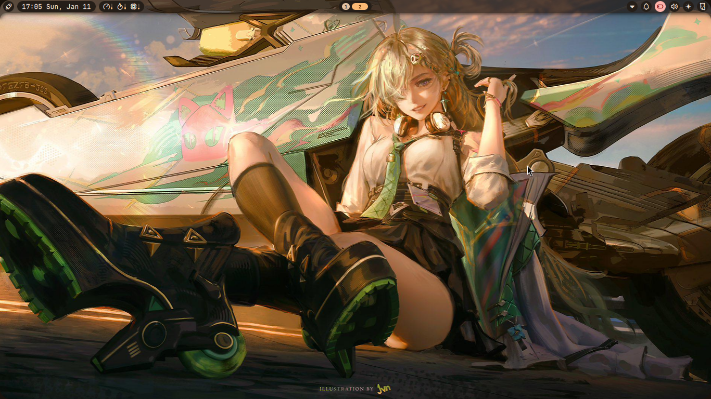

> Sunset Overdrive

 My personal Arch Niri setup

> DISCLAIMER

I used ai to help me with stuff like color schemes and window rounding, but https://github.com/Nocturnial/Sunset-Overdrive/edit/main/README.mdNOT complex scripts. I am disclosing this to be honest and genuine. USE THIS AT YOUR OWN RISK or take it as inspiration. I am NOT responsible for it not working on your setup.

>  INSTALLATION

 Simply clone this repo and cd into it:
 
 git clone https://github.com/Nocturnial/Sunset-Overdrive/
 cd ~/Sunset-Overdrive/
 
 Then just copy and paste the files (except readme and license) to your ~/.config/ folder.

> Once again, im not responsible for setup breakages. Go crazy.

>SCREENSHOT

